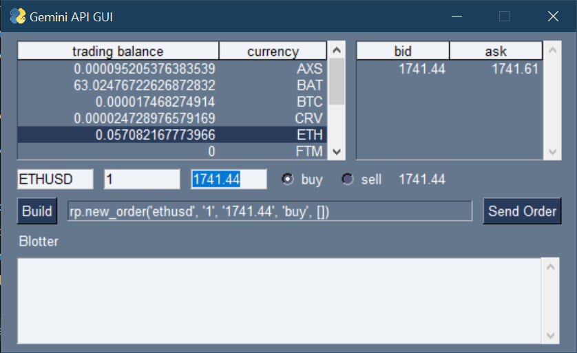

# gemini_api

A python-based GUI for accessing the Gemini API

Extends:
- [gemini-python](https://github.com/mtusman/gemini-python)
- [PySimpleGUI](https://github.com/PySimpleGUI/PySimpleGUI)

Provided under the MIT License

Disclaimer:
use at your own risk

Bleg:
help improve FOSS, PR's welcome

#NFA

#DYOR

